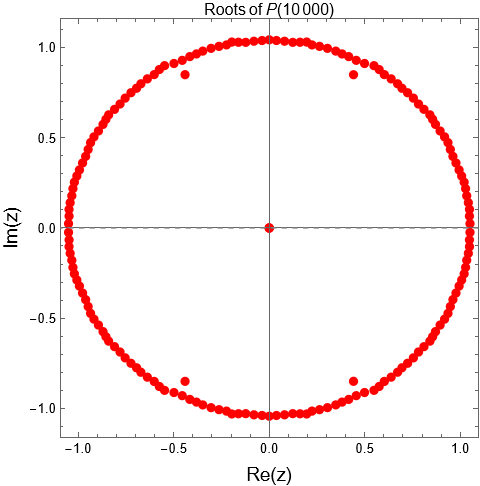
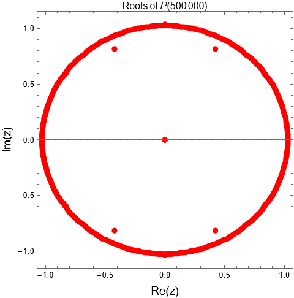

# For even $n \ge 8$, $\pi_2(n-5) = \pi(n-3) + \pi(n-5) + H(n) - n/2$


---------------------------------------------


## Goldbach's Conjecture and how to calculate $\pi(n)$ and $\pi_2(n)$

-----------------------------------------------------

Goldbach’s Conjecture (GC) is a well-known unproven mathematical statement. It asserts that every even integer,
 $n\geq 4$ can be expressed as the sum of two prime numbers. Assuming GC holds true, then for any even integer $n$, there exist prime 
 numbers $p$ and $q$ such that $n = p + q$. Let $p_n$ be the smallest prime number for which $q_n= n-p_n$ is also a prime. Define the following functions:
	$\pi(n)$ as the number of primes less than or equal to $n$, $\pi_2(n)$ as the number of twin primes less than or equal to $n$, $\delta_{6}(n)$ as the number of primes $p$ that $q-p \geq 6$, where $q$ is the next prime after $p$, $F_{n}(x)$ as the number of times that $p_k=x$ for every $k$, where $6 \leq k \leq n$, in other words, $F_{n}(x)$ counts how often a prime $x$ appears as the smallest prime in the Goldbach partition for even integers $k$ within the range $6 \leq k \leq n$. Then, the following relationships hold: 
 
 (i) $\pi(n) = F_n(3)+1$, 
 
 (ii) $\pi_2(n) =F_n(3)-F_n(5)$ and 
 
 (iii) $\delta_6(n) = F_n(7)$

-----------------------------------------------------

 Compile: g++ Goldbach_optimize.cc -o Goldbach_optimize -lz

 Run: ./Goldbach_optimize 1000000 result_1000000.gz

 Frequencies: python Goldbach_freq.py result_1000000.gz 1000000

 Output: $F_{1000000}(3)=78497$, $F_{1000000}(5)=70328$ and $F_{1000000}(7)=62185$
 
 Therefore, $\pi(1000000) = F_{1000000}(3)+1 = 78498$,   $\pi_2(1000000)=F_{1000000}(3) - F_{1000000}(5) = 8169$ and $\delta_6(1000000)=F_{1000000}(7)=62185$.
 
        
PS.: $F_n(5)$ is the number of primes $p \leq n$ such that $p+2$ is not a prime.

------------------------------------------------------

## Simple Example:

n = $p_n$ + $q_n$

4 = 2 + 2,

6 = 3 + 3,

8 = 3 + 5,

10 = 3 + 7,

12 = 5 + 7,

14 = 3 + 11,

16 = 3 + 13,

18 = 5 + 13,

20 = 3 + 17,

22 = 3 + 19,

24 = 5 + 19,

26 = 3 + 23,

28 = 5 + 23,

30 = 7 + 23,

32 = 3 + 29,

34 = 3 + 31,

36 = 5 + 31,

38 = 7 + 31,

40 = 3 + 37,

42 = 5 + 37,

44 = 3 + 41,

46 = 3 + 43,

48 = 5 + 43,

50 = 3 + 47


In this example, $F_{50}(3) = 14$ and $F_{50}(5) = 7$.
Therefore, $\pi(50) = F_{50}(3) + 1 = 15$ and $\pi_{2}(50) = F_{50}(3) - F_{50}(5) = 14 - 7 = 7$.

-----------

Maybe you should go with the polynomial approach instead. Take a look at: https://doi.org/10.13140/RG.2.2.35628.12162

## Prime Counting Goldbach Polynomials  P(n)


This paper introduces the polynomial $P(n) = \sum_{\substack{k=4 \\ k \text{ even}}}^{n} x^{p(k)}$, where $p(k)$ denotes the smallest prime such that $k - p(k)$ is also prime, reflecting the minimal prime in a Goldbach partition of the even integer $k$. We derive explicit formulas for the coefficients $c_m$ of $P(n) = \sum_m c_m x^m$, where the sum is over primes $m \geq 2$.

For $m = 2$, the coefficient is $c_2 = 1$ if $n \geq 4$, and 0 otherwise. For odd primes $m$, $c_m$ counts the number of primes $r$ in the range $3 \leq r \leq n - m$ such that no smaller prime $p < m$ yields a prime pair $r + (m - p)$. This is formalized via inclusion-exclusion: $c_m = \sum_{A \subseteq S} (-1)^{|A|} N_A(L)$, with $S = \mathbb{P} \cap (2, m)$, $L = n - m$, and $N_A(L)$ the count of odd primes $r \leq L$ where $r + (m - p)$ is prime for each $p \in A$.

Simplified expressions are provided for small primes: for $m = 3$, $c_3 = \pi(n - 3) - 1$; for $m = 5$, $c_5 = \pi(n - 5) - 2 - (\pi_2(n - 5) - 1)$, where $\pi_2(y)$ counts twin primes up to $y$; and for $m = 7$, $c_7 = \pi(n - 7) - 2 - (\pi_2(n - 7) + \pi_4(n - 7) - 1) + [3 \leq n - 7]$, with $\pi_4(y)$ counting cousin primes up to $y$.

To illustrate, consider $n = 30$. The polynomial is $P(30) = x^2 + 8x^3 + 4x^5 + x^7$. Using the formulas:  
- $c_2 = 1$ (since $n \geq 4$),  
- $c_3 = \pi(27) - 1 = 9 - 1 = 8$,  
- $c_5 = \pi(25) - 2 - (\pi_2(25) - 1) = 9 - 2 - (4 - 1) = 4$,  
- $c_7 = \pi(23) - 2 - (\pi_2(23) + \pi_4(23) - 1) + 1 = 9 - 2 - (4 + 4 - 1) + 1 = 1$,  
matching the explicit computation.

For a larger example, take $n = 50$. The polynomial is $P(50) = x^2 + 14x^3 + 7x^5 + 2x^7$, with coefficients verified as:  
- $c_3 = \pi(47) - 1 = 15 - 1 = 14$,  
- $c_5 = \pi(45) - 2 - (\pi_2(45) - 1) = 14 - 2 - (6 - 1) = 7$,  
- $c_7 = \pi(43) - 2 - (\pi_2(43) + \pi_4(43) - 1) + 1 = 14 - 2 - (6 + 6 - 1) + 1 = 2$.  

These results offer a novel framework for analyzing Goldbach partitions through generating functions, with potential implications for prime distribution studies.

Coefficients of Goldbach Polynomials: https://oeis.org/A391043

## How to Use the Goldbach Polynomial Generator Goldbach_polynomial.py

Run the script from the command line with an even integer $n \geq 4$:

```
python goldbach_polynomial.py <even_number_n>
```

### Examples

1. For \( n = 30 \):
   ```
   python goldbach_polynomial.py 30
   ```
   Output:
   ```
   x^2 + 8x^3 + 4x^5 + x^7
   ```

2. For \( n = 50 \):
   ```
   python goldbach_polynomial.py 50
   ```
   Output:
   ```
   x^2 + 14x^3 + 7x^5 + 2x^7
   ```

3. For \( n = 100 \):
   ```
   python goldbach_polynomial.py 100
   ```
   Output:
   ```
   x^2 + 24x^3 + 15x^5 + 8x^7 + x^{19}
   ```
### Roots of $P(n)$

$P(10000)= x^2 + 1228 x^3 + 1023 x^5 + 821 x^7 + 526 x^{11} + 382 x^{13} + 
 	241 x^{17} + 235 x^{19} + 126 x^{23} + 81 x^{29} + 107 x^{31} + 47 x^{37} + 
 	33 x^{41} + 32 x^{43} + 24 x^{47} + 24 x^{53} + 11 x^{59} + 25 x^{61} + 
 	10 x^{67} + 3 x^{71} + 5 x^{73} + 5 x^{79} + 2 x^{83} + x^{97} + x^{103} + x^{127} + 
 	2 x^{139} + x^{157} + x^{173}$

<p align="center">
  
</p>


Let $z_{n,k}$ be the k-th root of the polynomial $P(n)$. Then for almost all $k$, $z_{n,k}$ satisfy $|z_{n,k}| \to 1$ as $n \to \infty$ 

<p align="center">
  
</p>

Here is a version tailored to a **computational / numerical / data-oriented audience**, appropriate for GitHub users who care about algorithms, experiments, and diagnostics more than proofs:

---

### Goldbach polynomials

This approach translates additive questions about prime numbers into concrete, finite polynomials whose coefficients are derived from prime data, and studies the location of their complex zeros as numerical invariants. An analytic result shows that the distance between the point (z=1) and the nearest zero is tightly controlled by how much coefficient mass lies at small indices, making this “spectral gap” a sensitive statistic for detecting structural changes in the data. Under standard probabilistic models for primes (such as Hardy–Littlewood heuristics), the framework predicts a specific scaling law for this gap, which can be tested numerically. Extensive computations show that polynomials built from actual prime data follow the predicted scaling, while synthetic or perturbed models exhibit visibly different spectral behavior. The goal is not to resolve prime conjectures, but to provide a reproducible computational diagnostic for comparing prime models and validating heuristic assumptions through spectral data.


## Maximal Prime Polynomial

By the way, the zeros of the polynomial $P(n) = \sum_{\substack{k=4 \\ k \text{ even}}}^{n} x^{k-p(k)}$, where $p(k)$ denotes the smallest prime such that $k - p(k)$ is also prime, reflecting the maximal prime in a Goldbach partition of the even integer $k$, have the same property. 

## Twin Prime and Goldbach Conjectures: A Quantitative Link


Assuming the **Goldbach conjecture**, for even $k \ge 4$, let $p(k)$ be the smallest prime such that $(k - p(k))$ is prime.
Define the polynomial

```math
P(n) = \sum_{\substack{4 \le k \le n \\ k \text{ even}}} x^{p(k)}
     = \sum_{\substack{m \text{ prime} \\ m \ge 2}} c_m(n) x^m,
```

where $c_m(n)$ counts the even $k \le n$ with $p(k) = m$.

The author's explicit formulas include:

```math
c_3(n) = \pi(n-3) - 1,
\qquad
c_5(n) = \pi(n-5) - 1 - \pi_2(n-5).
```

The sum of coefficients is $n/2 - 1$ for even $n$.
Let

```math
H(n) = \sum_{m \ge 7,\; m \text{ prime}} c_m(n).
```

---

### Theorem

For even $n \ge 8$,

```math
\pi_2(n-5)
= \pi(n-3) + \pi(n-5) + H(n) - \frac{n}{2}.
```

### Python Code
python VerifyFormula_H.py 10000

| n   | pi_2(n-5) | pi(n-3) | pi(n-5) | H(n) | n/2 | right_side | formula_correct |
|-----|-----------|---------|---------|------|-----|------------|-----------------|
| 8   | 1         | 3       | 2       | 0    | 4   | 1          | Yes             |
| 10  | 2         | 4       | 3       | 0    | 5   | 2          | Yes             |
| 12  | 2         | 4       | 4       | 0    | 6   | 2          | Yes             |
| 14  | 2         | 5       | 4       | 0    | 7   | 2          | Yes             |
| 16  | 3         | 6       | 5       | 0    | 8   | 3          | Yes             |
| 18  | 3         | 6       | 6       | 0    | 9   | 3          | Yes             |
| 20  | 3         | 7       | 6       | 0    | 10  | 3          | Yes             |
| 22  | 4         | 8       | 7       | 0    | 11  | 4          | Yes             |
| 24  | 4         | 8       | 8       | 0    | 12  | 4          | Yes             |
| 26  | 4         | 9       | 8       | 0    | 13  | 4          | Yes             |
| 28  | 4         | 9       | 9       | 0    | 14  | 4          | Yes             |
| 30  | 4         | 9       | 9       | 1    | 15  | 4          | Yes             |
| 32  | 4         | 10      | 9       | 1    | 16  | 4          | Yes             |
| 34  | 5         | 11      | 10      | 1    | 17  | 5          | Yes             |
| 36  | 5         | 11      | 11      | 1    | 18  | 5          | Yes             |
| 38  | 5         | 11      | 11      | 2    | 19  | 5          | Yes             |
| 40  | 5         | 12      | 11      | 2    | 20  | 5          | Yes             |
| 42  | 5         | 12      | 12      | 2    | 21  | 5          | Yes             |
| 44  | 5         | 13      | 12      | 2    | 22  | 5          | Yes             |
| 46  | 6         | 14      | 13      | 2    | 23  | 6          | Yes             |
| 48  | 6         | 14      | 14      | 2    | 24  | 6          | Yes             |
| 50  | 6         | 15      | 14      | 2    | 25  | 6          | Yes             |
| 52  | 6         | 15      | 15      | 2    | 26  | 6          | Yes             |
| 54  | 6         | 15      | 15      | 3    | 27  | 6          | Yes             |


| n         | pi_2(n-5) | pi(n-3) | pi(n-5) | H(n)     | n/2      | right_side | formula_correct |
|-----------|-----------|---------|---------|----------|----------|------------|-----------------|
| 1795544234 | 5795581  | 88653001 | 88653001 | 726261696 | 897772117 | 5795581   | Yes             |
| 1795544236 | 5795581  | 88653001 | 88653001 | 726261697 | 897772118 | 5795581   | Yes             |
| 1795544238 | 5795581  | 88653001 | 88653001 | 726261698 | 897772119 | 5795581   | Yes             |
| 1795544240 | 5795581  | 88653002 | 88653001 | 726261698 | 897772120 | 5795581   | Yes             |
| 1795544242 | 5795582  | 88653003 | 88653002 | 726261698 | 897772121 | 5795582   | Yes             |
| 1795544244 | 5795582  | 88653003 | 88653003 | 726261698 | 897772122 | 5795582   | Yes             |
| 1795544246 | 5795582  | 88653003 | 88653003 | 726261699 | 897772123 | 5795582   | Yes             |
| 1795544248 | 5795582  | 88653003 | 88653003 | 726261700 | 897772124 | 5795582   | Yes             |
| 1795544250 | 5795582  | 88653003 | 88653003 | 726261701 | 897772125 | 5795582   | Yes             |
| 1795544252 | 5795582  | 88653003 | 88653003 | 726261702 | 897772126 | 5795582   | Yes             |

## Generalization

For integer $k \geq 1$ and even $n \geq 8 + 2k$,
		
$\pi_2(n-5) - \pi_2(n - 5 - 2k) = \bigl[ \pi(n-3) - \pi(n - 3 - 2k) \bigr] + \bigl[ \pi(n-5) - \pi(n - 5 - 2k) \bigr] + \bigl[H(n) - H(n - 2k)\bigr] - k.$	
		
or
		
## $k = \Delta_{\pi_a} + \Delta_{\pi_b} + \Delta_{H} - \Delta_{\pi_2}$
		
		
where $\Delta_{\pi_2}= \pi_2(n-5) - \pi_2(n - 5 - 2k)$ , $\Delta_{\pi_a}=\pi(n-3) - \pi(n - 3 - 2k)$, $\Delta_{\pi_b} = \pi(n-5) - \pi(n - 5 - 2k)$ and $\Delta_H =  H(n) - H(n - 2k)$.


Note that for $k=1$, this reduces to: $\pi_2(n-5) - \pi_2(n-7) = \pi(n-3) - \pi(n-7) + H(n) - H(n-2) - 1$


------------
cite: https://doi.org/10.5281/zenodo.17913888, https://doi.org/10.13140/RG.2.2.22119.76963 , https://doi.org/10.13140/RG.2.2.15449.58721

Watch the video of an explanation given by NotebookLM: https://www.youtube.com/watch?v=bHPlp-CiYO4
